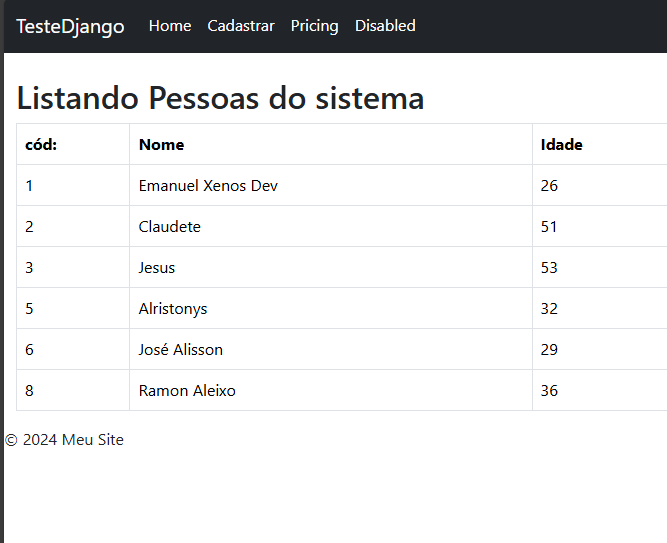

# Projeto simples Djano Python
## Nese projeto foi realizado um todo list de pesssoas.

    
O que foi utlizado no projeto?

    
 No projeto foi utilizado nenhuma bilioteca externa, só o material nativo do Django. O objetivo era testar, e conhecer uma tecnologia nova, nunca utilizada antes no seguimento Web.

    
Nesse sistema simples, foi usado o banco sqlite3 e a operações já existentes para manipulação de dados, sem a necessidade de trabalhar com operações mais lagedas, tipo cirar as querys de consultas e etc. Abaixo você vai ter uma uma pequena prévia

    

